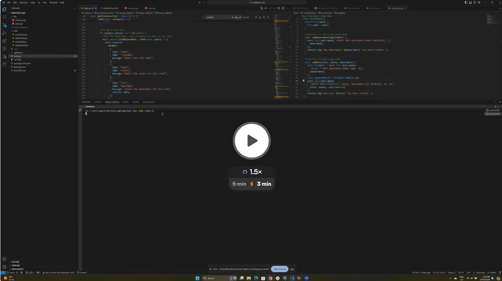

# Employee CMS

  [](https://opensource.org/licenses/MIT)
  
  ## DESCRIPTION
This employee CMS will make looking after your company database a breeze! Use this app to view, add, update and delete your department, employee and role data, all through the ease of the command line. 

Video walkthrough:
[](https://www.loom.com/share/815f5b18f4054659b28f638f498c410f?sid=27fd26c7-48fd-4cab-94c2-dd76ec4b1ac7)

Screenshots


  ## TABLE OF CONTENTS
  
  <ol>
  <li><a href="#description">Description</a></li>
  <li><a href="#installation">Installation</a></li>
  <li><a href="#usage">Usage</a></li>
  <li><a href="#licence">Licence</a> </li>
  <li><a href="#contributions">Contributions</a></li>
  <li><a href="#questions">Questions</a></li>
  </ol>
  
  ## INSTALLATION
To clone from Github, use GitBash   
```git@github.com:gaylemcclure/employee-cms.git```
  
  ## USAGE
  Upon installation of the project, start the generator using the terminal with the command   
  ```node index.js```
  This will then bring up the list of options available to you.   
  Select your required option to view or alter data as necessary, then select EXIT to stop.  
  The options available are: 
- View all departments
- View all roles
- View all employees
- View employees by manager
- View employees by department
- View total budget by department
- Add a department
- Add a role
- Add an employee
- Update employee role
- Update employee manager
- Delete department
- Delete role
- Delete employee

  
  ## LICENCE
  Distributed under the MIT license. For more information, see <a href=https://opensource.org/licenses/MIT>here</a>
  
  ## CONTRIBUTIONS
  Created by Gayle McClure   
  Uses JavaScript, node.js, postgres db
  
  
  ## QUESTIONS
  Github Username: <a href='https://github.com/gaylemcclure'>Gayle McClure</a>  
  Feel free to email me at gaylekdennison@gmail.com for further questions. 
